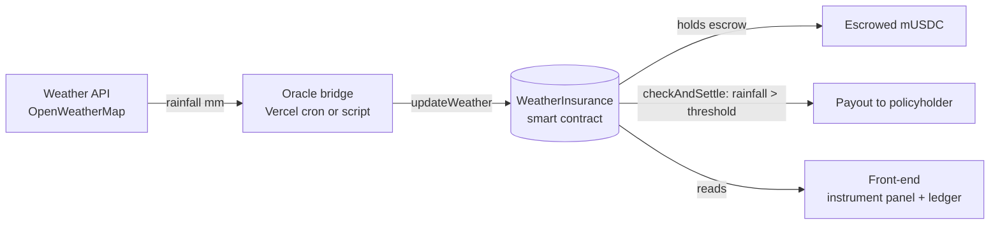

# Squall Line: Parametric Rainfall Insurance

A smart contract that holds test funds in escrow and **pays out automatically when an oracle reports rainfall above a threshold**. No claim form, no adjuster: the on-chain weather reading is the claim.

Built as a hackathon / expo demo. It ships with a Solidity contract, a serverless oracle bridge, and a front-end that you can deploy to Vercel in minutes.

> **Testnet only.** This code is unaudited demo software. Never use a wallet that holds real funds with it.

## How it works



1. A policy is written with a payout amount, a rainfall threshold (default **> 50 mm**) and a time window. The payout is locked in escrow immediately.
2. An authorized oracle address posts rainfall readings on-chain via `updateWeather()`.
3. Anyone can call `checkAndSettle(policyId)`. If the latest in-window reading exceeds the threshold, the escrowed funds go to the policyholder and the policy becomes `Triggered`.
4. If the window closes first, the policy expires with no payout.

## Features

- **Solidity contract** with escrow, oracle access control, per-policy thresholds and windows, and pull-based settlement
- **Three interchangeable oracle paths:** a Vercel cron job, a Node CLI script, and a Chainlink Functions payload
- **Front-end** with a live rainfall gauge, strip-chart history, policy ledger, status stamp and oracle log
- **Two modes:** a built-in client-side simulation that works with zero setup, and live mode that reads and writes a real testnet contract
- **Demo-day button:** "Simulate weather event" runs the whole storm-to-payout sequence on demand, so you never depend on real weather
- **Hardhat tests** for the payout path and oracle access control

## Repository layout

```
public/index.html        Front-end (static)
api/
  status.js              GET   Contract + latest policy snapshot
  weather.js             GET   Weather proxy (API key stays server-side)
  oracle.js              GET   Cron: fetch weather, post on-chain, settle if triggered
  simulate.js            POST  Demo button: push a storm reading and settle
  reset.js               POST  Re-arm the demo with a fresh policy
  _lib/                  Shared chain + weather helpers
contracts/
  WeatherInsurance.sol   Escrow and payout logic
  MockUSDC.sol           6-decimal test token (public faucet)
scripts/deploy.js        Deploys both contracts and writes one demo policy
oracle/
  oracle-bridge.js       Real OpenWeatherMap to chain
  mock-oracle.js         Push any rainfall value by hand
  chainlink-functions-source.js   Chainlink Functions payload
test/                    Hardhat tests
vercel.json              Vercel config (output dir, cron, headers)
```

## Quick start

**Requirements:** Node.js 20+ and Git.

```bash
git clone https://github.com/YOUR-USERNAME/squall-line-insurance.git
cd squall-line-insurance
npm install
npx hardhat test
```

Run the front-end locally (simulation mode, no config needed):

```bash
npx vercel dev
```

Then open http://localhost:3000.

## Deploy the contract (Sepolia)

1. Create a **throwaway** wallet and fund it with Sepolia ETH from a faucet.
2. Get a Sepolia RPC URL from Alchemy or Infura.
3. Configure and deploy:

```bash
cp .env.example .env      # Windows: copy .env.example .env
# fill in RPC_URL and PRIVATE_KEY
npm run deploy:sepolia
```

The script deploys `MockUSDC` and `WeatherInsurance`, mints test funds, writes one demo policy (500 mUSDC payout, trigger above 50 mm, 7-day window), and prints `CONTRACT_ADDRESS` and `TOKEN_ADDRESS`.

Leave `ORACLE_ADDRESS` blank so the deployer wallet becomes the oracle. The Vercel API routes require the server wallet to be the oracle.

## Deploy the app to Vercel

1. Push this repo to GitHub.
2. In Vercel: **Add New, Project**, import the repo, and set **Framework Preset** to **Other**. `vercel.json` handles the rest.
3. Deploy. With no environment variables, the site runs in **simulation mode**.
4. To go live, add the variables below under **Settings, Environment Variables**, then redeploy.

| Variable | Purpose | Notes |
|---|---|---|
| `RPC_URL` | Chain access | Sepolia RPC URL. Setting this and `CONTRACT_ADDRESS` switches the UI to live mode |
| `CONTRACT_ADDRESS` | Deployed contract | From the deploy script |
| `PRIVATE_KEY` | Server wallet | **Testnet-only.** Must be the contract's oracle |
| `CRON_SECRET` | Protects `/api/oracle` | Any long random string |
| `ENABLE_SIMULATE` | Enables demo buttons | `true` turns on `/api/simulate` and `/api/reset` |
| `TOKEN_ADDRESS` | Escrow token | Needed for Reset station |
| `OPENWEATHER_API_KEY`, `LAT`, `LON` | Real weather | Optional. Omit to use mock readings |
| `CHAIN_NAME`, `EXPLORER_URL`, `TOKEN_DECIMALS`, `HOLDER_ADDRESS` | Display and policy defaults | Defaults: Sepolia, Etherscan, 6, server wallet |

Generate a cron secret with:

```bash
node -e "console.log(require('crypto').randomBytes(32).toString('hex'))"
```

## Running the oracle

Pick whichever fits your setup:

```bash
npm run oracle             # one real OpenWeatherMap fetch and post
npm run oracle:watch       # repeat every 15 minutes
npm run oracle:mock -- 62.5   # push 62.50 mm by hand
```

The Vercel cron (`/api/oracle`) does the same on a schedule. Alternatively, upload `oracle/chainlink-functions-source.js` as a Chainlink Functions source and point a consumer contract at `updateWeather()`.

## Contract reference

| Function | Access | Description |
|---|---|---|
| `updateWeather(uint256 rainfallMm100)` | oracle | Post a reading, in mm x 100 (`5012` = 50.12 mm) |
| `writePolicy(holder, payout, thresholdMm100, windowStart, windowEnd)` | anyone | Create a policy and escrow the payout (requires token approval) |
| `checkAndSettle(policyId)` | anyone | Pay out if the threshold is breached in-window; expire if the window closed |
| `cancelPolicy(policyId)` | owner | Cancel an active policy and reclaim the escrow |
| `setOracle(address)` | owner | Change the oracle address |
| `isConditionMet(policyId)` | view | Free check the front-end can poll |

## Limitations

- **Last-hour rain, not a true 24h total.** The free OpenWeatherMap endpoint reports the last hour. The contract compares whatever the oracle posts, so treat the trigger as "latest reading above the threshold". A rolling 24h sum needs One Call 3.0 or your own accumulator.
- **Demo endpoints are unauthenticated.** `/api/simulate` and `/api/reset` let any visitor spend testnet gas and tokens from the server wallet, with only a per-instance 20-second cooldown. Turn `ENABLE_SIMULATE` off outside demos.
- **Vercel Hobby cron runs once per day at most.** The default schedule is daily at 12:00 UTC. Use `npm run oracle:watch` or a paid plan for a faster feed.
- **Single oracle, open `writePolicy`.** One address is a trust and availability bottleneck, and anyone can write a policy. Production use needs a decentralized oracle (for example a Chainlink DON), underwriting and pricing gates, and an audit.
- **`MockUSDC.faucet()` mints freely.** Testnet only.

## Tech stack

Solidity 0.8.24, OpenZeppelin 5, Hardhat, ethers v6, Vercel serverless functions and cron, vanilla HTML/CSS/JS (Zilla Slab and IBM Plex Mono).

## License

MIT, as declared in the contract SPDX headers. Add a `LICENSE` file if you publish the repo publicly.
